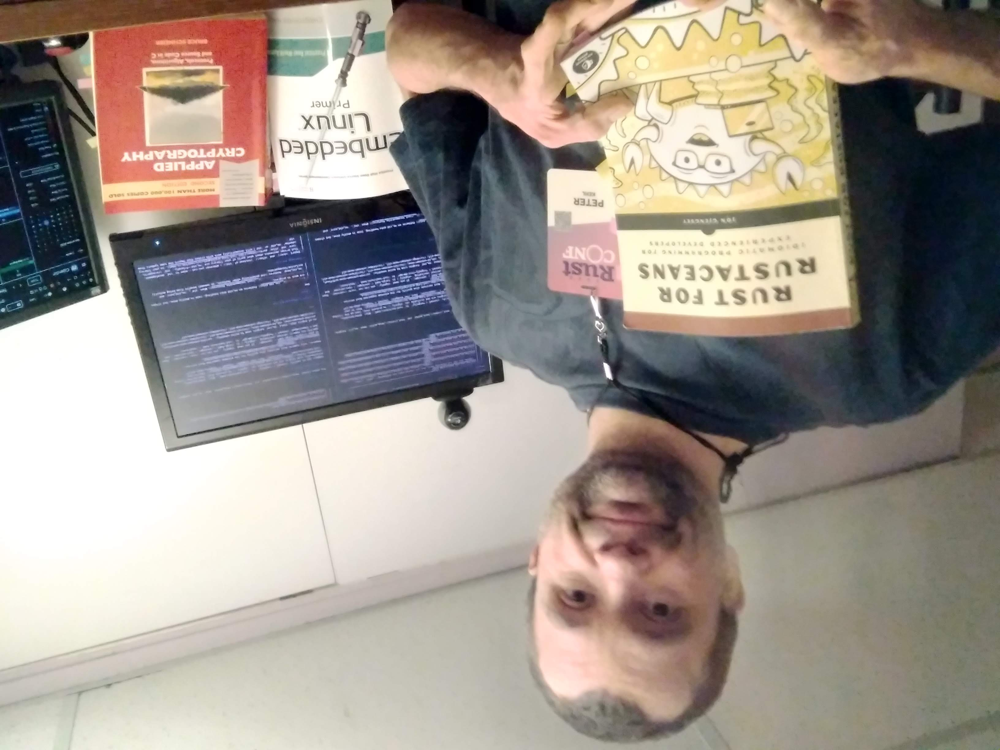

# I love Rust

## Why Rust

While I've worked in several programming languages, but Rust. It makes memory and concurrency safe.
It is explicit and any side effects are controlled. Types are pretty good. Also, I love the
community of Rustaceans.

## Current projects

- <a href="https://github.com/scale-rs/">scale-rs</a>: libraries for productivity and ergonomics
- on hold:
- smart slices (<a href="https://github.com/ranging-rs/slicing-rs">ranging-rs/slicing-rs</a><!--
  [ranging-rs/slicing-rs](https://github.com/ranging-rs/slicing-rs))-->),
- smart ranges (<a href="https://github.com/ranging-rs/ranging-rs">ranging-rs/ranging-rs</a><!--
  [ranging-rs/ranging-rs](https://github.com/ranging-rs/ranging-rs)-->),
- heap and heapless functionality (<a
  href="https://github.com/ranging-rs/heappie">ranging-rs/heappie</a><!--[ranging-rs/heappie](https://github.com/ranging-rs/heappie)-->),
- patterns on handling data in `no_std` (embedded-friendly) Rust (<a
  href="https://github.com/peter-kehl/no_std_data">no_std_data</a><!--[peter-kehl/no_std_data](https://github.com/no_std_data)-->),
- cooperative allocation - only for pure safe applications (<a
  href="https://github.com/coop-rs">coop-rs/coop</a><!--[coop-rs/coop](https://github.com/coop-rs)-->).
  Starting in December 2022.

## Presentations

- `no_std` libraries in Rust [no_std_libs](https://peter-kehl.github.io/no_std_libs),
- Present Markdown with Reveal.js (on GitHub Pages)
  [present_markdown_reveal](https://peter-kehl.github.io/present_markdown_reveal.js/),
- `no_std` RNA slice patterns - a long-term set of 18 presentations:
  [no_std_rna_slice_patterns_presentation](https://github.com/peter-kehl/no_std_rna_slice_patterns_presentation),
  which I'll integrate into its related project <a
  href="https://github.com/peter-kehl/no_std_data">no_std_data</a><!--[no_std_data](https://github.com/peter-kehl/no_std_data)-->.
<!-- [Why declare incompatible `features` in Rust libraries?](https://peter-kehl.github.io/rust_incompatible_features) -->
<!-- https://peter-kehl.github.io/no_std_data/ -->

## Contributing

I'm open to long-term contracting and permanent positions. Extra points if it's open source.

## Contact
E-mail & LinkedIn: see left side on GitHub; <a rel="me"
href="https://hachyderm.io/@peter_kehl">Mastodon</a>.
